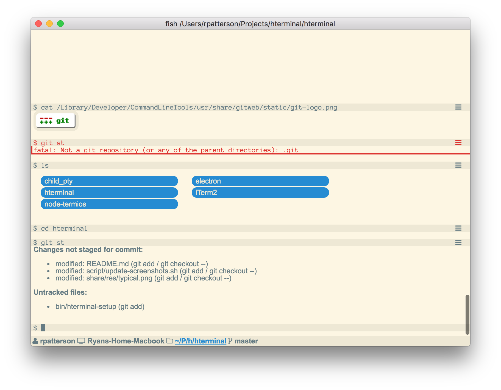

# What is HTerminal?

HTerminal is a new kind of terminal program. It works with all your existing programs and workflows, but can be extended to provide rich user experiences using HTML and CSS.

:warning: **Warning:** HTerminal is not ready for public consumption yet. You are welcome to download a copy to try out, but many features you expect from a terminal program are not yet implemented.



## Features

- Fully compatible with all existing terminal programs and shells. HTerminal enhances existing programs instead of replacing them.
- No learning curve. HTerminal automatically extends programs you already know how to use, but makes them work better.
- *Planned* - Customizable. You can install your own CSS stylesheets to change both the terminal as well as the HTML components from programs.
- *Planned* - Extendable. You can install packages to add new features.

## Compatibility

HTerminal aims to be compatible with most existing terminal programs without any modification. This allows you to start using HTerminal without fully changing around your workflow. Some programs that HTerminal currently works with are:

**Basic programs**

All normal terminal programs programs like ps, top, kill, ls, cd, etc. are all fully supported by HTerminal. HTerminal primarily works by providing transparent wrappers around exisitng commands to give them enhanced functionality (which can be disabled if needed).

- *Planned* - terminal styles like colors and bold are not currently implemented.

**Environment configurations**

Programs like rvm and virtualenv work just fine in HTerminal, because HTerminal is not a shell.

**Fish**

Fish is the preferred shell of HTerminal and all features of fish are supported and improved upon.

- *Planned* - Input interface utilizing all of the fish completions, but presented using a rich typeahead control.
- *Planned* - Shell integration to highlight commands and provide information like error highlighting and run time.

**Vim**

Vim currently is partially supported. It works for basic editing, for example a git commit message editor.

**SSH**

All HTerminal features work over SSH, because HTerminal does not need special software to communicate with programs. Note that tmux and mosh do not understand the HTerminal communication protocol. These programs work in HTerminal, but do not gain any of HTerminal's enhanced features.

**General REPL interface**

- Easily copy command output to the clipboard.
- Hide the output from an individual command.
- *Planned* - Review what the alternate screen was showing previously.
- *Planned* - Show run time and throbber.

**File management**

- It should be easy to open Finder to the directory you're in.
- Directory listings should behave like Finder windows, with drag-n-drop and double clicking to open them.
- cat should work on all file types, including offering a download proxy icon if the file is binary.

**Jupyter**

*Planned* - `jupyter console` should render HTML like `jupyter notebook` does.

**Git**

*Planned* - Run `git status` and an augmented status page shows up with buttons to stage, unstage, commit, etc files. Typing additional git commands will cause the existing status window to refresh. Git diff will open in a popup. Git commit opens the editor in a popup.

**iTerm 2**

- Shell integration allows you to set marks to jump to output of specific commands, identifies previous directories and allows downloading remote files.

Installation
============

**End-user installation**

The easiest way to try HTerminal is to use a prebuilt binary. HTerminal is not ready for widespread use, so the binary is unversioned but is kept up to date with the `master` branch of this repository.

:warning: **Warning:** HTerminal is not ready for public consumption yet. You are welcome to download a copy to try out, but many features you expect from a terminal program are not yet implemented.

1. [Download HTerminal](https://www.dropbox.com/s/cvq559t1ala32y8/HTerminal.zip?dl=0) and extract it to `~/Applications/`.
2. [Download and install Fish](https://fishshell.com) if you don't already use it. HTerminal supports all shells, but Fish has an out-of-the-box configuration already made.
3. Add the following to `~/.config/fish/init.fish`, or some other initialization file for Fish.
4. Launch HTerminal and type `ls`.

```fish
# Load hterminal shell integration
if [ ! -z $HTERMINAL_ROOT ]
  source $HTERMINAL_ROOT/share/shell/fish/init.fish
end
```

**Developer installation**

If you want to contribute to HTerminal, follow these steps:

1. Clone the repository.
2. `npm install` - If you get an error about electron, that's because electron `0.37.9` hasn't been released yet. You can change `package.json` to use `0.37.8`, but note that HTerminal will use 100% CPU in app mode (web mode will work fine).
3. Use `npm run develop-app` or `npm run develop-web` to launch a live-reloading HTerminal in either app (Electron) mode or web mode.
4. Use `./script/create-dist.sh` to create a standalone app in `HTerminal-darwin-x64`.

Note that `develop-app` still uses about 30% CPU; this seems to be caused by an incompatibility between webpack and electron. When you build a standalone app using `create-dist` the CPU usage for HTerminal is minimal.

HTML Mode
=========

HTerminal supports displaying HTML data in the terminal. This is accomplished using special escape sequences to instruct HTerminal to switch between "sections". A section is either text-based or HTML-based.

When HTerminal receives any output from the terminal, it will append it to the bottommost text-based section, creating a new one at the end if the last one is an HTML-based section.

The grammar for HTML escape codes follows:

```
wrapped-command = osc "1866;" command terminator
identify = csi "1866n"
osc = "\x1b]"
terminator = "\x07" | "\x1b\\"
csi = "\x1b["

command = insert-html | replace-html | replace-fixed-html
insert-html = "0;" document
replace-html = "1;" document
replace-fixed-html = "2;" id ";" document
```

A description of the effect of the commands follows:

identify
--------
Send version information. HTerminal will respond with CSI "HT " followed by the HTerminal version, followed by "n".

insert-html
-----------
Create a new HTML-based section at the end and fill it with the HTML document.

replace-html
------------
If the bottommost section is HTML-based, replace its contents with the HTML document. Otherwise, behaves identically to insert-html. If the document is empty, remove the section (allowing you to continue writing to the previous text-based section).

replace-fixed-html
------------------
Replace the contents of the fixed section named id with the HTML document.

REPL Integration
================

HTerminal sections are divided into groups. Using special escape codes, sections can be marked as prompts or command output in a typical REPL loop. These escape codes are shared with [iTerm2 Shell Integration](https://www.iterm2.com/shell_integration.html).

The grammar for REPL escape codes follows:

```
wrapped-command = osc "133;" command terminator
osc = "\x1b]"
terminator = "\x07" | "\x1b\\"

command = repl-prompt | repl-output | repl-end
repl-prompt = "A"
repl-output = "C"
repl-end = "D;" status
```

A description of the effect of the commands follows:

repl-prompt
-----------
If the current group has any sections marked as output, place the next output in a new section marked as the prompt in a new group.

repl-output
-----------
Place the next output in a new section marked as output.

repl-end
--------
If the current group has any sections marked as output, mark the current group as having completed with status and place the next output in a new section in a new group.

Troubleshooting
===============

- Adjusting the content in fixed sections like hterminal-status may cause the window size to change. If responding to the SIGWINCH causes the window size to change again, this may lead to an infinite loop.

Recommended reading
===================

- https://github.com/shockone/black-screen
- https://github.com/unconed/TermKit
- http://invisible-island.net/xterm/ctlseqs/ctlseqs.html
- http://www.asciitable.com/

Thoughts on completions
=======================

In order to get full control of reading lines with fish, a script is used to read lines and evaluate them. There are some problems:

- `fish --no-execute -c ")"` returns shell true despite being an invalid command.
- `commandline -f execute` redraws the command line before executing
- `eval`: `set -l` doesn't work and history isn't added.

I could have htfish_read_command output an escape start before returning, and an escape terminator in the preexec hook. I could also have the fish prompt be completely empty. If the prompt contains DSR, input will have to be consumed in a preexec hook.

CPU Usage in Electron
=====================

I compiled my own version of Electron in order to fix the CPU usage problem. The core of electron gets built normally, the `scripts/create-dist.py` is used to make a zip file.

```bash
cd ~/Projects/hterminal/electron
./scripts/build.py
./scripts/create-dist.py
cp dist/electron-v0.37.8-darwin-x64.zip ~/.electron/
cd ~/Projects/hterminal/hterminal
./script/create-dist.sh
```

This shouldn't be needed for any version after 0.37.8, when the pull was accepted.

Note that `develop-app` still uses about 30% CPU, this seems to be casued by an incompatibility between webpack and electron.
