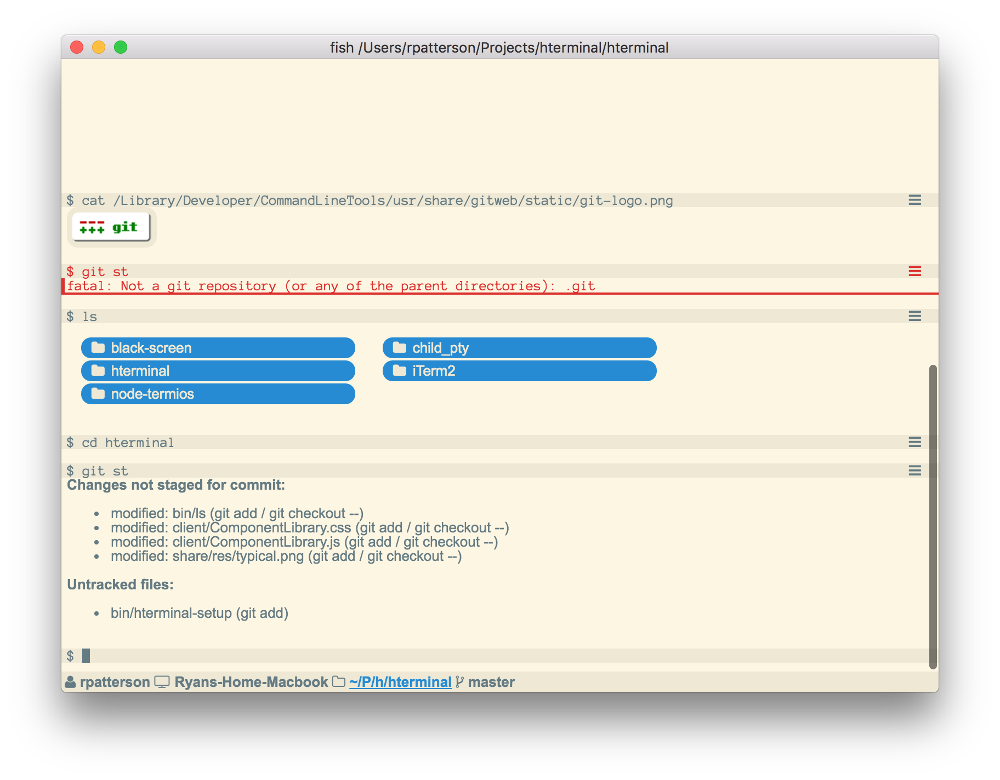

# What is HTerminal?

HTerminal is a new kind of terminal program. It works with all your existing programs and workflows, but can be extended to provide rich user experiences using HTML and CSS.



## Compatibility

HTerminal aims to be compatible with most existing terminal programs without any modification. This allows you to start using HTerminal without fully changing around your workflow. Some programs that HTerminal currently works with are:

**Basic programs**

All normal terminal programs programs like ps, top, kill, ls, cd, etc. are all fully supported by HTerminal. HTerminal primarily works by providing transparent wrappers around exisitng commands to give them enhanced functionality (which can be disabled if needed).

**Fish**

Fish is the preferred shell of HTerminal and all features of fish are supported and improved upon.

- *Planned* - Input interface utilizing all of the fish completions, but presented using a rich typeahead control.
- *Planned* - Shell integration to highlight commands and provide information like error highlighting and run time.

**Vim**

Vim currently is partially supported. It works for basic editing, for example a git commit message editor.

**SSH**

All HTerminal features work over SSH, because HTerminal does not need special software to communicate with programs. Note that tmux and mosh do not understand the HTerminal communication protocol. These programs work in HTerminal, but do not gain any of HTerminal's enhanced features.

**General REPL interface**

- Method to show command, output, exit status, run time, and a throbber.
- Method to save alternate screen contents and review it.

File management
---------------
- It should be easy to open Finder to the directory you're in.
- Directory listings should behave like Finder windows, with drag-n-drop and double clicking to open them.
- cat should work on all file types, including offering a download proxy icon if the file is binary.

Jupyter features
----------------
Jupyter has great table support, as well as images.

Git
---
- Run `git status` and an augmented status page shows up with buttons to stage, unstage, commit, etc files. Typing additional git commands will cause the existing status window to refresh. Git diff will open in a popup. Git commit opens the editor in a popup.

ITerm parity
------------
Shell integration allows you to set marks to jump to output of specific commands, identifies previous directories and allows downloading remote files.

Extensions
----------
ComponentLibrary is just a library, additional commands can easily be added to it via user scripts.

HTML Mode
=========

HTerminal supports displaying HTML data in the terminal. This is accomplished using special escape sequences to instruct HTerminal to switch between "cells". A cell is either text-based or HTML-based.

When HTerminal receives any output from the terminal, it will append it to the bottommost text-based cell, creating a new one at the end if the last one is an HTML-based cell.

The grammar for HTML escape codes follows:

```
wrapped-command = osc "1866;" command terminator
identify = csi "1866n"
osc = "\x1b]"
terminator = "\x07" | "\x1b\\"
csi = "\x1b["

command = insert-html | replace-html
insert-html = "0;" document
replace-html = "1;" id ";" document
```

A description of the effect of the commands follows:

identify
--------
Send version information. HTerminal will respond with CSI "HT " followed by the HTerminal version, followed by "n".

insert-html
-----------
Create a new HTML-based cell at the end and fill it with the HTML document.

replace-html
------------
Replace the contents of the cell identified by id with the HTML document.


Troubleshooting
===============

- Adjusting the content in fixed sections like hterminal-status may cause the window size to change. If responding to the SIGWINCH causes the window size to change again, this may lead to an infinite loop.

Recommended reading
===================

- https://github.com/shockone/black-screen
- https://github.com/unconed/TermKit
- http://invisible-island.net/xterm/ctlseqs/ctlseqs.html
- http://www.asciitable.com/

Distribution
============

There are 4 targets available:

- web / production - optimized socket.io client and matching server
- web / debug - hot-reloading socket.io client and matching server
- app / production - optimized electron app
- app / debug - hot-reloading electron app

Thoughts on completions
=======================

In order to get full control of reading lines with fish, a script is used to read lines and evaluate them. There are some problems:

- `fish --no-execute -c ")"` returns shell true despite being an invalid command.
- `commandline -f execute` redraws the command line before executing
- `eval`: `set -l` doesn't work and history isn't added.

I could have htfish_read_command output an escape start before returning, and an escape terminator in the preexec hook. I could also have the fish prompt be completely empty. If the prompt contains DSR, input will have to be consumed in a preexec hook.

CPU Usage in Electron
=====================

I compiled my own version of Electron in order to fix the CPU usage problem. The core of electron gets built normally, the `scripts/create-dist.py` is used to make a zip file.

```bash
cd ~/Projects/hterminal/electron
./scripts/build.py
./scripts/create-dist.py
cp dist/electron-v0.37.8-darwin-x64.zip ~/.electron/
cd ~/Projects/hterminal/hterminal
./script/create-dist.sh
```

This shouldn't be needed for any version after 0.37.8, when the pull was accepted.

Note that `develop-app` still uses about 30% CPU, this seems to be casued by an incompatibility between webpack and electron.
